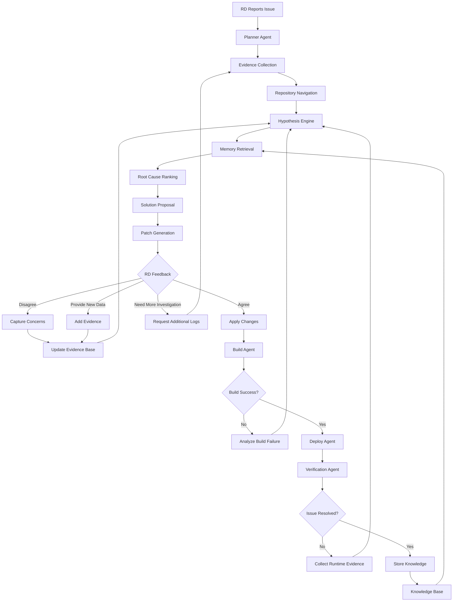
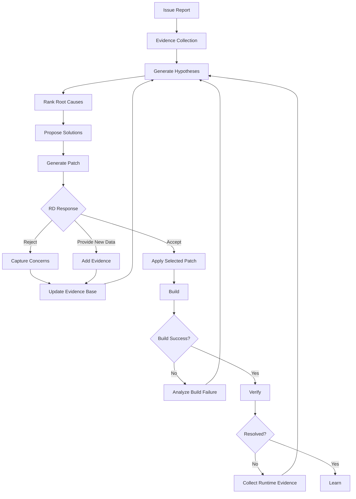

# RootPilot

> RootPilot reduces debugging uncertainty by collecting evidence, generating hypotheses, and guiding investigations.

Local-first AI debugging framework for large codebases.

RootPilot automates evidence collection, repository navigation, hypothesis generation, and root cause investigation while keeping engineers in the decision loop.

RootPilot supports two deployment modes:

- **Local**: Runs entirely on local infrastructure using Ollama, keeping sensitive source code and investigation data within the controlled environment for NDA-protected projects.
- **Cloud**: Connects to supported cloud-based AI providers, subject to the organization’s security, privacy, and compliance policies.

## Workspace Assumptions

RootPilot assumes that an engineering workspace is already available locally before an investigation begins.

Examples:

- UEFI repositories that have already been cloned locally.
- OpenBMC workspaces that have already completed a build and contain the relevant source code, build artifacts, recipes, or generated work directories.

RootPilot focuses on investigation, reasoning, and uncertainty reduction within an existing engineering workspace.

RootPilot is not responsible for:

- Repository cloning
- Source acquisition
- Workspace provisioning
- Build environment setup
- Initial platform bring-up

Different engineering environments may expose source code differently.

For example:

- UEFI repositories often contain source code directly and can be investigated immediately.
- OpenBMC repositories may contain metadata, recipes, build artifacts, generated workspaces, and source trees that require additional navigation.

RootPilot adapts repository navigation strategies to the workspace structure while keeping the investigation workflow consistent:

```text
Workspace
 ↓
Evidence Collection
 ↓
Repository Navigation
 ↓
Hypothesis Generation
 ↓
Root Cause Investigation
```

## Highlights

- Local and cloud AI provider support
- Local execution with Ollama for NDA-sensitive environments
- Evidence-driven debugging workflow
- Repository navigation with ripgrep and tree-sitter
- Human-in-the-loop hypothesis refinement
- CLI-first architecture

---

# Why RootPilot?

Modern AI coding tools are excellent at generating code.

However, many real-world engineering problems are not code generation problems.

They are investigation problems.

Common debugging workflows often involve:

- Large and unfamiliar codebases
- Incomplete logs and fragmented evidence
- Multiple competing hypotheses
- Domain-specific knowledge
- Iterative collaboration between engineers

In these situations, generating code is often the final step rather than the first.

RootPilot focuses on the investigation process that takes place before a fix is implemented.

```text
Issue
 ↓
Logs
 ↓
Evidence
 ↓
Hypotheses
 ↓
Most Probable Root Cause
 ↓
Solution
 ↓
Validated Patch
```

## Non-Goals

RootPilot is not intended to:

- Replace engineers
- Blindly generate patches
- Modify source code without supporting evidence
- Act as a general-purpose coding assistant
- Require cloud-hosted LLMs

Instead, RootPilot assists engineers by reducing uncertainty during complex investigations.

---

# Project Status

**Last Updated:** September 2026

| Area | Status |
|---|---|
| Local CLI Workflow | ✅ |
| Case File Loading | ✅ |
| Repository Text Collection | ✅ |
| Recent Git History Collection | ✅ |
| Ollama Hypothesis Generation | ✅ |
| Mistral Cloud Integration | ✅ |
| Human Feedback Workflow | ✅ |
| Solution Proposal | ✅ |
| Patch Generation | ✅ |
| Patch Validation and Application | ✅ |
| Structured Repository Navigation | 📋 |
| Root Cause Ranking | 📋 |
| Build Validation | 📋 |
| Deployment Automation | 📋 |
| Knowledge Accumulation | 📋 |

✅ Implemented  
🚧 In Progress  
📋 Planned

---

# Example Investigation

Prepare a case directory containing the issue description, logs, and local repository:

```text
examples/hdr_timeout/
├── issue.md
├── logs.txt
└── repo/
```

Run the investigation with the default local provider:

```bash
./rootpilot investigate examples/hdr_timeout
```

Run the investigation with a cloud provider:

```bash
./rootpilot investigate examples/hdr_timeout --provider mistral --model mistral-medium
```

Example output:

```text
Investigation Summary

Confidence: <model-generated score>%

Evidence Summary:
HDR capture freezes after recording during frame synchronization.

Hypotheses:
1. Frame synchronization failure
2. Capture startup timing problem
3. Frame waiting logic issue

Recommended Investigation:
Review the capture startup and frame synchronization paths.

Proposed Changes:

--- a/FrameSync.cpp
+++ b/FrameSync.cpp
@@ -1,4 +1,4 @@
 bool waitFrame()
 {
-    return wait_for_frame(10);
+    return wait_for_frame(100);
 }

[A] Accept
[R] Provide Feedback
[Q] Quit
Choice:
```

Select `R` to provide additional evidence:

```text
Choice: R
Additional evidence: Increasing the timeout did not resolve the issue.
```

RootPilot sends the issue, logs, repository content, recent Git history, and accumulated feedback to the selected AI provider.

The provider generates a new investigation result based on the updated evidence.

Select `A` to apply the validated proposed changes:

```text
Choice: A

Applied 1 change(s).
```

Select `Q` to end the investigation without applying the proposed changes.

---

# Key Insight

Most debugging systems treat feedback as approval.

RootPilot treats human feedback and experiment results as evidence.

Human observations, experiment outcomes, test results, and newly discovered facts are incorporated into the investigation alongside existing logs, source code, and recent Git history.

Engineers can continuously provide:

- New logs
- Crash dumps
- Reproduction steps
- Test results
- Experiment results
- Customer reports
- Domain knowledge

New evidence does not automatically override existing hypotheses.

Instead, RootPilot evaluates it together with previously collected evidence and may:

- Increase or reduce confidence in a hypothesis
- Re-rank probable root causes
- Trigger additional investigation
- Generate new hypotheses
- Propose revised solutions and patches

This evidence-driven feedback loop keeps engineers in control while progressively reducing investigation uncertainty.

## Hypothesis Revision

New evidence does not automatically invalidate existing hypotheses.

Instead, RootPilot:

1. Weighs the new evidence
2. Compares it against existing evidence
3. Re-ranks hypotheses
4. Updates confidence levels

A hypothesis is discarded only when the combined evidence no longer supports it.

Human feedback, experiment results, logs, source code, and historical changes are evaluated together as part of the investigation process.

The debugging process is treated as a continuous uncertainty-reduction cycle rather than a sequence of approvals and rejections.

---

# System Architecture



---

# Core Feedback Loop



---

# Technology Stack

## LLM Providers

- Ollama for local inference
- Mistral API for cloud inference

## Default Models

- Local: `qwen2.5-coder:3b`
- Cloud: User-selected Mistral model available to the API subscription

## Runtime

- Python

## Code Understanding

- tree-sitter
- ripgrep

## Investigation & Retrieval

- Git
- Qdrant

## Automation

- SSH
- SCP
- Docker

## Knowledge Representation

- YAML Skills
- Debug Playbooks
- Historical Cases

## Optional Integrations

- OpenHands
- MCP Servers
- Jira
- Confluence
- Slack

---

# Repository Structure

The repository is organized around investigation agents, reusable skills, and reproducible debugging cases.

```text
rootpilot/

├── agents/      # Investigation workflow
├── skills/      # Domain knowledge
├── memory/      # Historical investigations
├── tools/       # CLI integrations
├── examples/    # Reproducible cases
├── docs/        # Technical design
└── main.py
```

---

# Example Cases

```text
examples/

├── hdr_timeout/
│   ├── issue.md
│   ├── logs.txt
│   ├── rootpilot_output.md
│   └── final_fix.patch
│
├── race_condition_demo/
│
└── firmware_boot_failure/
```

Investigation workflow:

```text
Issue
 ↓
Logs
 ↓
Evidence
 ↓
Hypotheses
 ↓
Selected Root Cause
 ↓
Solution
 ↓
Patch
```

Each example is intended to demonstrate:

- Investigation workflow
- Evidence gathering
- Root cause reasoning
- Solution selection
- Patch generation

---

# Documentation

```text
docs/

├── architecture.md
├── investigation-workflow.md
├── memory-design.md
├── roadmap.md
└── example-cases.md
```

---

# Roadmap

## Phase 1 — Investigation Foundation

- Repository navigation
- Issue ingestion
- Evidence collection
- Git investigation
- Hypothesis generation
- Root cause ranking

## Phase 2 — Engineering Reasoning

- Confidence scoring
- Solution recommendation
- Memory retrieval
- Automatic code modification
- Build validation

## Phase 3 — Autonomous Validation

- Deployment automation
- Runtime verification
- Knowledge accumulation
- Continuous improvement

## Phase 4 — Advanced Systems

- Multi-agent collaboration
- Self-healing investigation loops
- Cross-project reasoning
- Team knowledge graphs

---

# Contributing

Contributions, investigation playbooks, reproducible debugging cases, and feedback are welcome.

---

# License

MIT

---

# Long-Term Goal

RootPilot aims to become an autonomous debugging system that continuously reduces uncertainty through evidence-driven investigation.

```text
Evidence
→ Hypothesis
→ Investigation
→ Feedback
→ Refined Hypothesis
→ Root Cause
→ Verification
→ Knowledge