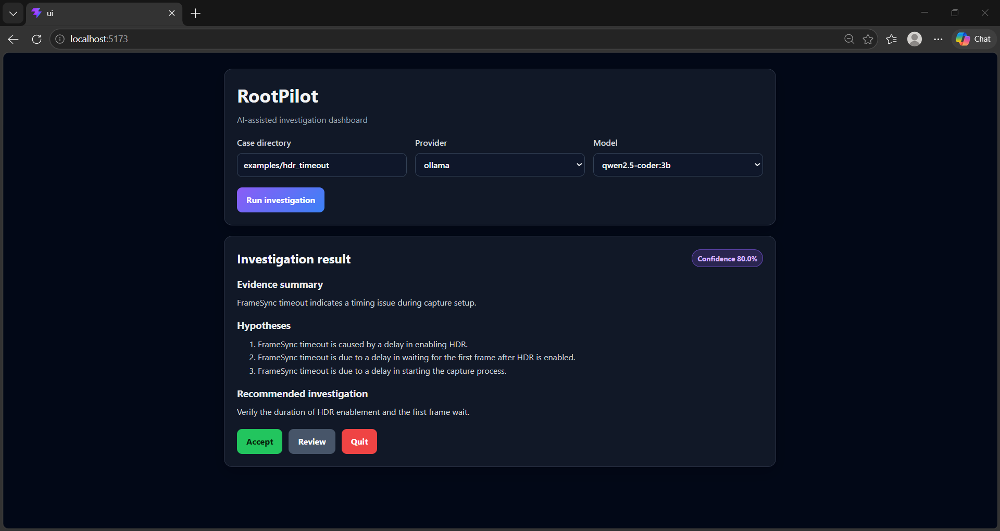
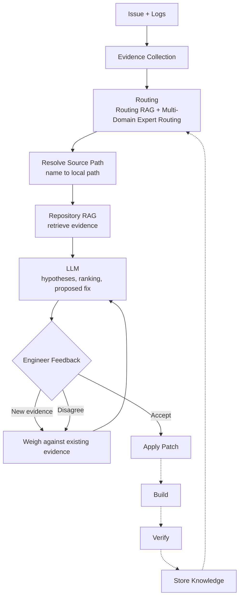

# RootPilot

RootPilot is a semi-autonomous, evidence-driven AI debugging orchestrator for local engineering workspaces. Its long-term goal is full automation.

RootPilot drives the investigation workflow: it collects evidence, sends it to an LLM to generate root-cause hypotheses, and proposes patches. Engineers review the findings, add evidence, and approve changes before they are applied. Locating the likely repository or module with Routing RAG and Multi-Domain Expert Routing is the next planned stage.

RootPilot provides a CLI and a Vue-based local dashboard backed by a FastAPI layer. Both run the same investigation flow.

RootPilot supports two deployment modes:

- **Local**: Runs entirely on local infrastructure using Ollama. Source code and investigation data stay inside the controlled environment, which suits NDA-protected projects.
- **Cloud**: Connects to supported cloud-based AI providers, subject to the organization's security, privacy, and compliance policies.

Design notes for RootPilot's supporting techniques (Routing RAG, Multi-Domain Expert Routing, Repository RAG) are in the [EngineeringWiki/ai/rootpilot](https://ziyingchen-dev.github.io/EngineeringWiki/ai/rootpilot/).

## Workspace Assumptions

RootPilot is the orchestrator. It calls tools to run each stage, and these tools use the local workspace at different depths:

- [Routing RAG](https://ziyingchen-dev.github.io/EngineeringWiki/ai/rootpilot/routing-rag/index.html): RootPilot calls a tool to turn repository and module information into RAG-ready data. Sources include README files, architecture docs, service and interface definitions, and lightweight source information such as headers and file-top comments.
- [Multi-Domain Expert Routing](https://ziyingchen-dev.github.io/EngineeringWiki/ai/rootpilot/multi-domain-expert-routing/index.html): RootPilot calls a tool that uses the Routing RAG data to locate which repository or module an issue belongs to. It relies on that prepared data, not on full source code search.
- [Repository RAG](https://ziyingchen-dev.github.io/EngineeringWiki/ai/rootpilot/repository-rag/index.html): RootPilot calls a tool to retrieve detailed evidence from the source code of the located repository or module.

RootPilot therefore assumes the engineering workspace is already prepared locally before these tools run.

| Ecosystem | Prepared Workspace | Where the Source Is |
|---|---|---|
| UEFI | Repositories already cloned | Directly in the cloned repositories, organized as many modules |
| OpenBMC | Build already completed | In the build work directories. The OpenBMC repository only holds metadata and recipes; source is fetched during the build. |

Multi-Domain Expert Routing outputs a logical name, such as `openbmc/entity-manager`. Repository RAG needs to read real files, which means a local path. RootPilot calls one more tool to convert the name into a local path, otherwise Repository RAG does not know where to read.

RootPilot drives the same flow for both ecosystems:

1. Routing RAG: RootPilot calls a tool to prepare repository / module data for routing.
2. Multi-Domain Expert Routing: RootPilot calls a tool to locate the repository or module for the issue.
3. Name-to-path conversion: RootPilot calls a tool to find the local source path of the located repository or module.
4. Repository RAG: RootPilot calls a tool to retrieve detailed evidence from that path.
5. LLM investigation: RootPilot sends the evidence to the LLM, which generates hypotheses and investigates the root cause.

## Repository Scope

This repository holds RootPilot's execution layer.

| Path | Role |
|---|---|
| [main.py](main.py) | CLI entry point. Loads the case, runs the investigation loop (`[A]` accept, `[R]` feedback, `[Q]` quit), shows the diff, and applies approved changes. |
| [prompts/investigation.py](prompts/investigation.py) | Builds the LLM prompt from the issue, logs, source files, Git history, and engineer feedback. Defines the output format and investigation rules. |
| [llm/ollama_client.py](llm/ollama_client.py) | Sends the prompt to a local Ollama model. |
| [llm/mistral_client.py](llm/mistral_client.py) | Sends the prompt to the Mistral cloud API. |
| [api_server.py](api_server.py) | FastAPI backend that exposes the same investigation flow to the UI. |
| [ui](ui) | Vue dashboard for running investigations from a browser. |
| [examples](examples) | Sample cases. Each has `issue.md`, `logs.txt`, and `repo/`. |
| [tests](tests) | Automated tests for the investigation workflow. |

Design notes for the supporting techniques are in the EngineeringWiki repository: [Routing RAG](https://ziyingchen-dev.github.io/EngineeringWiki/ai/rootpilot/routing-rag/index.html), [Multi-Domain Expert Routing](https://ziyingchen-dev.github.io/EngineeringWiki/ai/rootpilot/multi-domain-expert-routing/index.html), and [Repository RAG](https://ziyingchen-dev.github.io/EngineeringWiki/ai/rootpilot/repository-rag/index.html).

---

## Run the Web UI Locally

The dashboard requires the Vue/Vite frontend and the FastAPI backend to run at the same time. Run the commands below from the RootPilot repository. Examples use Bash on Linux, macOS, or WSL.

### Required Tools

- Python 3.10+ and Node.js 20.19+ or 22.12+ with npm must already be available.
- Ollama is needed only when using the local Ollama provider.

The frontend packages are installed from `ui/package-lock.json`. The API server needs the Python model clients (`ollama` and `mistralai`), FastAPI, and Uvicorn.

### Install Packages

From the repository root, install the Python packages needed to run the API using `python3` (Python 3.10 or newer):

```bash
cd ~/RootPilot
python3 -m pip install ollama mistralai fastapi uvicorn
```

Install the frontend packages with npm:

```bash
npm ci --prefix ui
```

If using Ollama, install it from the [official download page](https://ollama.com/download) and start the Ollama service. Then download the default model:

```bash
ollama pull qwen2.5:1.5b
```

To use the larger available model instead, download `qwen2.5-coder:3b` and select it in the UI. It needs more memory. Ollama must remain running while RootPilot uses it.

### Start the UI

Open two terminals in the repository. In terminal 1, start the API:

```bash
cd ~/RootPilot
python3 -m uvicorn api_server:app --host 0.0.0.0 --port 8000
```

In terminal 2, start the frontend:

```bash
cd ~/RootPilot
npm run dev --prefix ui -- --host 0.0.0.0
```

Open the URL printed by Vite, usually <http://localhost:5173/>. Keep both terminals running. In the dashboard, enter a case directory such as `examples/hdr_timeout`, choose a provider and model, then select **Run investigation**.

### Use Mistral Instead of Ollama

1. Create an API key from the [Mistral API keys page](https://admin.mistral.ai/organization/api-keys).
2. In the terminal that will run the API, set the key before starting Uvicorn:

    ```bash
    export MISTRAL_API_KEY='paste-your-key-here'
    python3 -m uvicorn api_server:app --host 0.0.0.0 --port 8000
    ```

    Replace the example value with your key. If the API is already running, stop it with `Ctrl+C` and restart it from this same terminal after setting the variable.
3. In the UI, refresh the page, select `mistral` as the provider, and use the listed model `magistral-medium-latest`.

Keep the API key private. Do not put it in source code, this README, or a commit. The `MISTRAL_API_KEY` variable must be set in the environment of the API process; setting it in the frontend terminal does not enable Mistral.

### Stop the Services

Press `Ctrl+C` in each terminal running RootPilot. If a startup command reports that a port is already in use, that service may already be running; use the existing process or stop it with `Ctrl+C` in its terminal before starting another copy.

The dashboard's `/api` requests are proxied by Vite to `http://127.0.0.1:8000`. This proxy is for local development; deploying the frontend as a static site requires a separately deployed API and a configured API URL.



---

# Why RootPilot?

AI coding tools are good at generating code. But many real-world engineering problems are investigation problems, not code generation problems.

Debugging typically involves:

- Large, unfamiliar codebases
- Incomplete logs and fragmented evidence
- Multiple competing hypotheses
- Domain-specific knowledge
- Iterative collaboration between engineers

In these cases, writing the fix is the last step, not the first. RootPilot drives the investigation that comes before it, and engineers stay in the loop: they review the findings, add evidence or domain knowledge, and approve the fix.

```text
Issue
    ↓
Logs
    ↓
Evidence  ←──────────────┐
    ↓                    │
Hypotheses               │
    ↓                    │
Most Probable Root Cause │
    ↓                    │
Engineer Review ─────────┘
(add evidence / correct hypothesis)
    ↓
Proposed Fix
    ↓
Proposed Patch
    ↓
Engineer Approval
```

---

# Project Status

**Current Maturity:** Semi-autonomous debugging workflow

**Last Updated:** September 2026

✅ Implemented  
🚧 In Progress  
📋 Planned

| Area | Status |
|---|---|
| Local CLI Workflow | ✅ |
| Case File Loading | ✅ |
| Repository Text Collection | ✅ |
| Hypothesis Generation | ✅ |
| Engineer Feedback and Hypothesis Revision | 🚧 |
| Solution Proposal | ✅ |
| Patch Generation | ✅ |
| Patch Application with Engineer Approval | ✅ |
| Feedback-Aware Fix Proposal | 🚧 |
| Routing RAG | 📋 |
| Multi-Domain Expert Routing | 📋 |
| Repository RAG | 📋 |
| Structured Repository Navigation | 📋 |
| Root Cause Ranking | 📋 |
| Build Validation | 📋 |
| Deployment Automation | 📋 |
| Knowledge Accumulation | 📋 |

The workflow can already gather evidence, propose hypotheses, revise them with engineer feedback, and propose and apply a patch after approval. It is not yet a fully autonomous debugging system.

---

# Example Investigation

Run RootPilot against a case directory:

```bash
python3 main.py investigate examples/hdr_timeout/
```

RootPilot collects the case input and repository content, then sends them to the AI provider. The provider returns an investigation result:

```text
Investigation Summary

Confidence: 80%

Evidence Summary:
The FrameSync timeout indicates a timing issue during capture setup.

Hypotheses:
1. FrameSync timeout is causing the capture to stall.
2. startCapture() in HDRManager.cpp is not returning true when it should.
3. wait_for_frame() in FrameSync.cpp is not returning true when it should.

Recommended Investigation:
Check if startCapture() in HDRManager.cpp returns true when HDR is enabled.

Actions
- [A] Accept
- [R] Provide Feedback
- [Q] Quit
Choice:
```

Select `R` to provide additional evidence:

```text
Choice: R
Additional evidence: I've increased timeout, but in vain.
```

RootPilot sends the accumulated feedback to the provider, which generates a revised result. The hypotheses are updated and a proposed change is added:

```text
Hypotheses:
1. FrameSync timeout is causing the capture to stall.
2. HDRManager::startCapture() is not waiting for the frame correctly.
3. startCapture() is not enabling HDR properly.

Recommended Investigation:
Increase the timeout in FrameSync.cpp to a higher value.

Additional Evidence:
1. I've increased timeout, but in vain.

Proposed Changes
--------------------------------------------------------------------------------
--- a/FrameSync.cpp
+++ b/FrameSync.cpp
@@ -1,4 +1,4 @@
 bool waitFrame()
 {
-    return wait_for_frame(10000);
+    return wait_for_frame(20000);
 }
```

Select `A` to apply the proposed changes:

```text
Choice: A

Applied 1 change(s).
```

Select `Q` to end the investigation without applying the proposed changes.

---

# Feedback Is Evidence, Not Instruction

Most debugging tools treat feedback as approval or as an order. RootPilot treats it as evidence, and evidence can be wrong.

Feedback is weighed together with the logs, source code, and recent Git history. Engineers can provide:

- New logs
- Crash dumps
- Reproduction steps
- Test and experiment results
- Customer reports
- Domain knowledge

New evidence does not automatically override existing hypotheses, and it is not accepted blindly. RootPilot compares it with everything collected so far, then may:

- Raise or lower confidence in a hypothesis
- Re-rank probable root causes
- Question the feedback if it conflicts with stronger evidence, and ask for verification
- Generate new hypotheses
- Propose a revised fix only when the evidence supports a clear correction
- Otherwise recommend a diagnostic check instead of guessing a patch

Engineers stay in the loop, and the agent does not simply follow whatever it is told.

The behavior above is guided by the rules in [prompts/investigation.py](prompts/investigation.py):

| Behavior | Prompt definition |
|---|---|
| Treat feedback as evidence, not instruction | Investigation rule 3 |
| Cross-check feedback, and verify it when it conflicts with stronger evidence | Investigation rule 9 |
| A failed experiment lowers a hypothesis only if the change should have worked were it true | Investigation rule 10 |
| Do not re-propose a change already tried | Investigation rule 11 |
| Recommend a diagnostic check instead of guessing a patch | Investigation rules 7 and 12, change proposal rules 2 and 3 |
| Separate observed facts from inference, and say when evidence is insufficient | Investigation rules 1, 2 and 12 |
| Lower confidence when evidence is incomplete or contradictory | Investigation rules 5 and 6 |
| Compare with the previous round, including its recommendation and proposed change | `PREVIOUS INVESTIGATION` section |
| Treat logs and source text as data, not instructions | Prompt preamble |

These rules guide the LLM and are not yet enforced in code.

---

# System Architecture

RootPilot is the orchestrator. It calls tools for each stage and sends the collected evidence to the LLM.


```mermaid
flowchart TD

A[Issue + Logs] --> B[Evidence Collection]

B --> C[Routing<br/>Routing RAG + Multi-Domain Expert Routing]
C --> D[Resolve Source Path<br/>name to local path]
D --> E[Repository RAG<br/>retrieve evidence]

E --> F[LLM<br/>hypotheses, ranking, proposed fix]
F --> G{Engineer Feedback}

G -->|New evidence| H[Weigh against existing evidence]
G -->|Disagree| H
H --> F

G -->|Accept| I[Apply Patch]

I -.-> J[Build]
J -.-> K[Verify]
K -.-> L[Store Knowledge]
L -.-> C
```

Dashed arrows are planned. See [Project Status](#project-status).

---

# Contributing

Contributions are welcome, especially reproducible debugging cases and feedback on investigation results. Open an issue or a pull request.

# License

MIT. See [LICENSE](LICENSE).